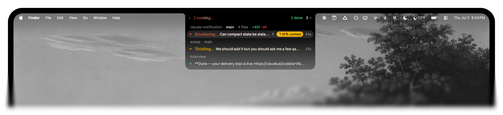
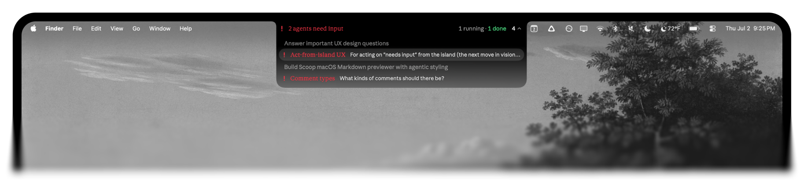
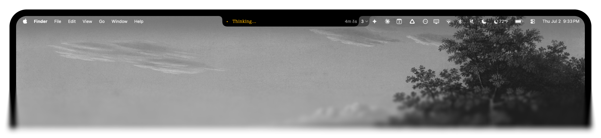
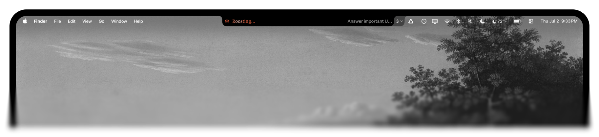
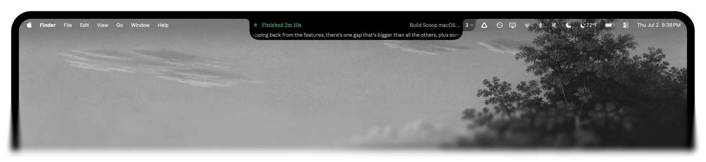
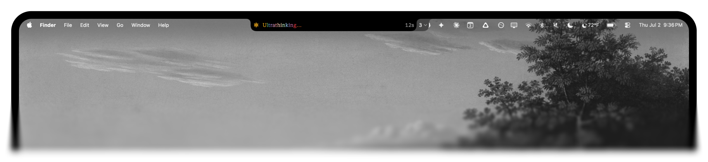
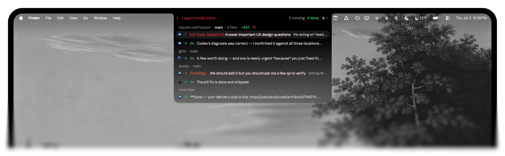
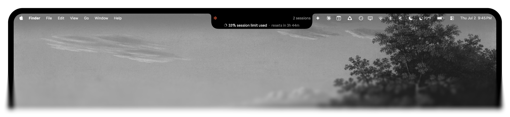

# Agents Island

A live-activity **island in your Mac's notch** for your coding agents. See what every session is doing — across all your terminals and apps — and jump back to the exact one with a click. Wired for [Claude Code](https://docs.anthropic.com/en/docs/claude-code) and [Codex](https://github.com/openai/codex) out of the box; the surface itself is agent-agnostic.

```bash
npx agents-island
```

> macOS 13+ (best with a notch) · Xcode Command Line Tools (`xcode-select --install`) · Claude Code and/or Codex.



## Every session at a glance

Run Claude Code in five tabs — plus a Codex chat or two — and the notch pill becomes a fleet dashboard. It tallies how many sessions are working, waiting on you, or done. Open the dropdown and each one is its own row, grouped by repo and branch, with its live verb, turn timer, and context-window fill.



## Claude Code and Codex, one notch

Running Claude Code in your terminal and Codex in the desktop app? They share the island. Codex Desktop chats show up as their own cards — same live status, same one-click focus (a `codex://` deep link takes you straight to that conversation) — so you watch every agent from one place instead of alt-tabbing between apps. Toggle Codex on or off anytime from the menu-bar **Show Codex** item.

## Live status, not just a "done" ping

The pill shows a spinner while Claude thinks or runs a tool, turns red the moment a session needs your input, and settles to a green ✻ when it finishes. The full taxonomy is color-coded in real time: thinking, working, waiting for input, compacting, struggling (a run of tool errors), interrupted/declined (you hit Esc), and API errors.


*Thinking…*


*Working, with its live verb and turn timer.*


*Finished — green ✻, frozen turn timer, and a peek at the reply.*

Type "ultrathink" and the verb goes rainbow, letter by letter:



## Click to jump back to the exact tab

Clicking a session focuses the precise terminal tab it's running in — not just the app. Warp uses its deep link, iTerm2 / Apple Terminal / Ghostty use AppleScript, and Cursor / VS Code use their CLI to focus the right workspace window. No hunting through tabs to find the one that's waiting on you.

## Works across every terminal you use

Warp, iTerm2, Apple Terminal, Ghostty, Cursor, and VS Code are all detected automatically. When you're running Claude in more than one app at once, each dropdown row is tagged with that app's icon, so a Warp session reads differently from a Cursor one at a glance.



## Token and context awareness

Every session carries a ring showing how full its context window is, so you can see who's about to compact. Hover the notch itself for a peek at your token-usage windows — the last 5 hours, today, and this week — without leaving what you're doing.



## Supported terminals

Detection and app-icon tagging work everywhere; click-to-focus fidelity depends on what each terminal exposes:

| Terminal | Detected | Click focuses… |
|----------|:---:|---|
| Warp | ✅ | the exact tab (deep link) |
| iTerm2 | ✅ | the exact tab (AppleScript) |
| Apple Terminal | ✅ | the exact tab (AppleScript) |
| Ghostty | ✅ | the exact tab (AppleScript, by working dir) |
| Cursor / VS Code | ✅ | the workspace window (`code`/`cursor` CLI) |
| others | ✅ | brings the app frontmost |

## Commands

```bash
npx agents-island install     # compile, install, wire up the Claude Code hook
npx agents-island test        # cycle through the states so you can see it
npx agents-island doctor      # check your install if something looks off
npx agents-island uninstall   # remove the app, hook, and config
```

> **First click:** the notch works with no special permissions. The first time you
> *click* a session to jump to its tab, macOS asks to let Agents Island control that
> terminal — click **OK**. Denied it by accident? Re-enable under System Settings →
> Privacy & Security → Automation.

## How it works

Claude Code [hooks](https://docs.anthropic.com/en/docs/claude-code/hooks) fire on each turn. `agents-island` installs a small hook that, on every event, extracts the session's state from the transcript and writes it to `~/.agents-island/sessions/<tab>.json`. A lightweight native menu-bar daemon watches that folder and renders the notch pill.

Because the daemon just renders those session files, the agent-specific part is only what *writes* them — and that part is swappable. Claude Code writes them through a hook; Codex, which has no hooks, gets tailed from its `~/.codex` session logs instead. Same files, same island. Adding another agent is just another writer.

## Requirements

- **macOS 13+.** Built for the notch (MacBook Pro/Air 2021+); on a notch-less Mac it
  still runs, anchored to the menu-bar strip instead.
- **Xcode Command Line Tools** — `xcode-select --install`. The installer compiles a ~200KB
  native app locally (ad-hoc signed, no Apple Developer account needed). Because it builds
  on your machine rather than downloading a binary, there's no Gatekeeper "unidentified
  developer" prompt. `python3`, which the hook runs on, comes with the Command Line Tools.
- **[Claude Code](https://docs.anthropic.com/en/docs/claude-code) and/or [Codex](https://github.com/openai/codex)** — at least one. Claude Code wires up via hooks; Codex Desktop is picked up automatically from its session logs (no config).

## Uninstall

```bash
npx agents-island uninstall
```

Removes the app bundle, the LaunchAgent, and the hook from `~/.claude/settings.json`.

## License

MIT
